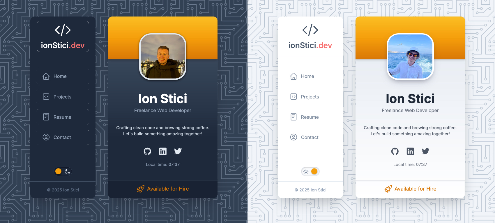

# Profile Card Section

A modern, responsive profile card component built with Next.js, TypeScript, and Tailwind CSS. Features a smooth theme toggle with context-aware profile images that adapt to the current theme.

## Links and Preview

[**View Demo Live**](http://ionstici.github.io/profile-card)

<details open>
<summary><b>Toggle Preview</b></summary>
<br>



<br>
</details>

## Tech Stack

- **Framework:** React/Next.js with TypeScript
- **Styling:** Tailwind CSS
- **Animations:** Framer Motion
- **Build Tool:** Next.js built-in bundler
- **Deployment:** Static site generation + GitHub Pages

## Features

- Dynamic theme switching (dark/light mode)
- Context-aware profile images that change based on theme
- Fully responsive design
- Smooth animations using Framer Motion
- Clean, minimal UI using Tailwind CSS
- Built with TypeScript for type safety
- Static site generation with Next.js

## Installation

```bash
# Clone the repository
git clone https://github.com/ionStici/profile-card.git

# Go to directory
cd profile-card

# Install dependencies
npm install

# Run the development server
npm run dev
```

## License

This project is licensed under the MIT License. See [LICENSE](./LICENSE) file for more information.
